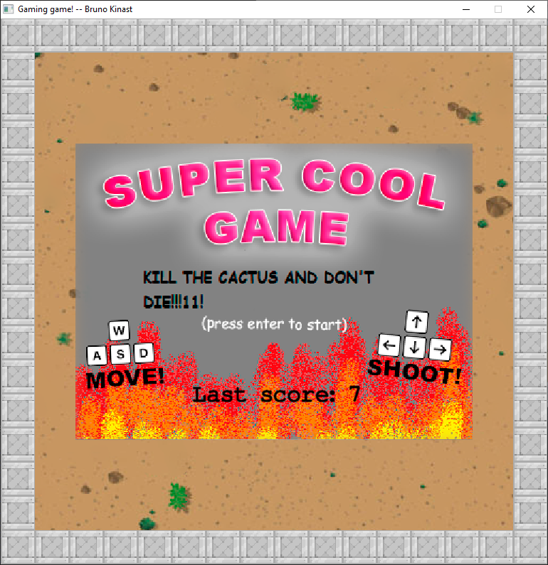
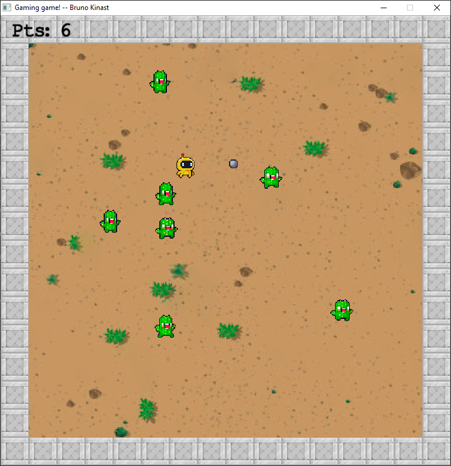

# Super Cool Game

<table>
    <tr>
        <td></td>
        <td></td>
    </tr>
</table>

## Overview
This project is a simple game developed in C++ using OpenGL. The game includes various objects such as players, enemies, bullets, and textures. The game logic is implemented in multiple C++ files.

## Files Description
The game is located in the `Game` directory. The following files are included in the project:

- **Bullet.cpp / Bullet.h**: Implements the bullet logic.
- **Enemy.cpp / Enemy.h**: Implements the enemy logic.
- **Game.cpp**: Contains the main game loop and game logic.
- **GameObject.cpp / GameObject.h**: Base class for all game objects.
- **Main.cpp**: Entry point of the game.
- **Player.cpp / Player.h**: Implements the player logic.
- **SpriteRenderer.cpp / SpriteRenderer.h**: Handles rendering of sprites.
- **Texture.cpp / Texture.h**: Manages texture loading and binding.
- **SoundPlayer.cpp / SoundPlayer.h**: Handles sound effects.
- **Textures/**: Directory containing texture files.

## How to Build
To build the project, you can use the provided tasks in the `.vscode/tasks.json` file. Open the command palette in Visual Studio Code and run the build task.
The file `Main.cpp` is the entry point of the game.

A release build is also provided here in GitHub. You can download the release and run the executable to play the game.

## Dependencies
The project depends on several libraries which are included in the `Dependencies` directory. Make sure to include these dependencies when building the project.